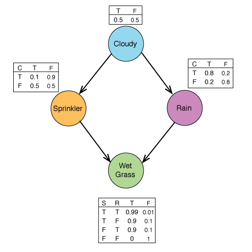

Python Bayesian Network Toolbox (PBNT)<br/> Bayes Network Model for Python 2.7
=========================

PBNT is a bayesian network model for python that was created by Elliot Cohen in 2005. This version updates his version that was built for Python 2.4 and adds support for modern python libraries. Most namely, it removes the reference to numArray and replaces it with numPy.

With this library it is possible to input a Bayesian Network with probabilities/conditional probabilities on each node to calculate the marginal and conditional probabilities of queries on the network.

The original version of the project [can be found here](http://sourceforge.net/projects/pbnt.berlios/)

PBNT Usage
-------------------
You must first have the [NumPy](http://www.numpy.org/) package installed.

###The included example network:
The example files give a simple example of how a Bayes Network can be implemented. It uses a Bayes Network created from 4 nodes, Cloudy, Rainy, Sprinkler, and WetGrass.

Here is a layout of what the network looks like
Inline-style:



To run the example files navigate to the examples directory and run:
```
$ python exampleinference.py
```
if everything is working properly, you should get:
```
The marginal probability of sprinkler=false: 0.7
The marginal probability of wetgrass=false | cloudy=False, rain=True: 0.3025
```

Creating a Model:
-------------------

**BayesNode(id,numValues,name)**

  - id: Integer Identification of the node
  - numValues: Number of associated values with the node
  - name: name for the node in form ```name="name_of_node"```

Example:
```python
cNode = BayesNode(0, 2, name="cloudy")
```

Declare Parent and Child Nodes to nodes:

```python
cNode.addChild(sNode)
cNode.addParent(cNode)
```

Assign Nodes to an array

```python
nodes = [cNode, sNode, rNode, wNode]
```

set the distributions

An example to set distribution of probability that is not conditional:
```python
#cloudy distribution
cDistribution = DiscreteDistribution(cNode)
index = cDistribution.generate_index([],[])
cDistribution[index] = 0.5
cNode.set_dist(cDistribution)
```
Note: The distribution index is 0.5, which sets the probability for both true and false automatically since (1 - 0.5) is 0.5.

An example for conditional probability
```python
#sprinkler
dist = zeros([cNode.size(),sNode.size()], dtype=float32)
dist[0,] = 0.5
dist[1,] = [0.9,0.1]
sDistribution = ConditionalDiscreteDistribution(nodes=[cNode, sNode], table=dist)
sNode.set_dist(sDistribution)
```
Note: Dist[1,] = [0.9,0.1] is read that given cNode (cloudy) == True, the probability of Sprinkler being False is 0.9 and true is 0.1.

Once the distributions are created, assign the node array to a Bayes Network
```python
bnet = BayesNet(nodes)
```

Building an Inference:
-------------------
Based on the index of the nodes in your model, assign your nodes to variables:
```python
for node in water.nodes:
      if node.id == 0:
          cloudy = node
      if node.id == 1:
          sprinkler = node
      if node.id == 2:
          rain = node
      if node.id == 3:
          wetgrass = node
```
Then create the inference engine:
```python
engine = JunctionTreeEngine(bnet)
```
Set evidence if needed:
```python
engine.evidence[cloudy] = False
engine.evidence[rain] = True
```
Generate a Query and calculate the marginal probability given the evidence
```python
Q = engine.marginal(wetgrass)[0]
index = Q.generate_index([False],range(Q.nDims))
```
Note: The first line sets the variable we are examining, in this case wetgrass. The generate index function specifies the result we are looking for, in this instance, we are looking to see if wetgrass is false.

Print out the probability found
```python
print Q[index]
```

Project information
-------------------
**Modified from:**<br/>
Python Bayes Network Toolbox.
Copyright (c) 2005, Elliot Cohen. All rights reserved.

**Updated to work with Python 2.7** by Brandon Mikulka
